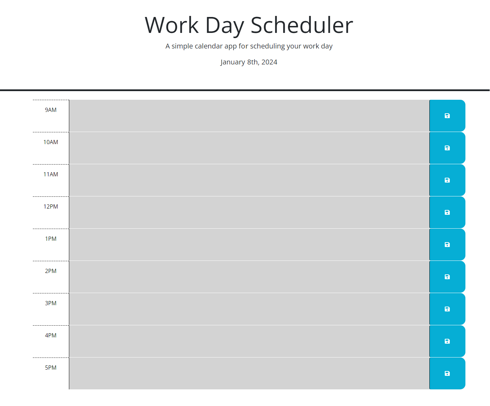

# Work Day Scheduler

## Description
The goal of this Work Day Scheduler is to demonstrate what I have learned about JQuery, Third Party APIs, DOM traversal, and DayJS. 

### Specific Objectives:
1. Add important events to a daily planner to manage a busy work schedule
2. When the planner is opened, the current day is displayed at the top of the calendar
3. When the user scrolls down, they are presented with timeblocks for standard business hours of 9am - 5pm
4. Each timeblock is color coded to indicate whether it is in the past (grey), present(red), or future(green)
4. When clicking on a timeblock, the user can enter an event
5. When the user clicks the "save" icon, the text is saved in local storage
6. When the page is refreshed, the saved events persist

## Installation
No installation is needed to use this resource, simply follow the link to the webpage

## Screenshot

## Link
https://ms-meredith-mcd.github.io/WorkDayScheduler